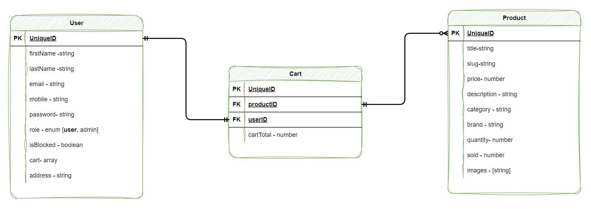

## My Store API

<p>This is an Ecommerce API Application. The API will provide essential functionality for managing products, user accounts, shopping carts, orders, payments, and more. It will be accessible via RESTful endpoints to support both web and mobile clients.</p>

---

### Installation

```
npm install
```

### API endpoints:

#### Auth: (Base_Url: http://localhost:4000/api/v1)

```
POST (public) - '/register' - register a new user (default role: user)

POST (public) - '/login' - login or sign in (generate a access token for 1 hour)
```

#### User: (Base_Url: http://localhost:4000/api/v1)

```
Admin only:
-----------
GET (private) - '/users' - Fetch all users

GET (private) - '/users/:id' - Fetch a user
```

#### Product: (Base_Url: http://localhost:4000/api/v1)

```
Admin only:
-----------
POST (private) - '/products' - Create a new Product
PATCH (private) - '/products/:id' - Update a product
DELETE (private) - '/products/:id' - Delete a product

Users/Visitors:
---------------
GET (public) - '/products' - Fetch all products
GET (public) - '/products/:id' - Fetch a product

```

### ER Diagram:



### Important links:

- [Notion] : https://omniscient-alarm-ccc.notion.site/E-commerce-API-95c06ca52843463f8828c5f97487e3d8
